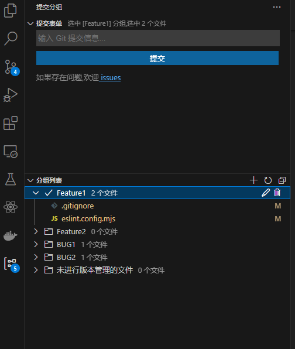

# Commit Group

[中文文档](README_zh.md)

A VS Code extension for managing Git modified files in groups, allowing you to maintain multiple commit groups simultaneously.

## Features

- Support grouping Git modified files
- Support dragging files between different groups  
- Support group operations like rename and delete
- Support committing single group
- Support committing multiple files in a single group
- Automatic file tracking status handling
- Support exporting group file list
- Support viewing file changes

## Screenshots

## Notes

- Workspace must have initialized Git repository
- When deleting active group, will prompt to select next active group
- Merge conflict files will be automatically categorized into specific group
- Does not support committing multiple files in group at once to prevent mistakes

## Installation

Search for "Commit Group" in VS Code extension marketplace.

## License

MIT
